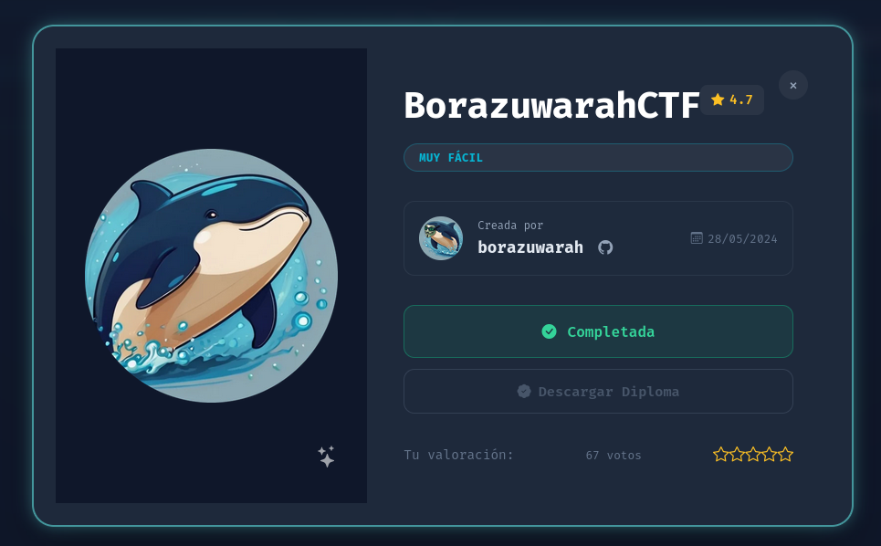
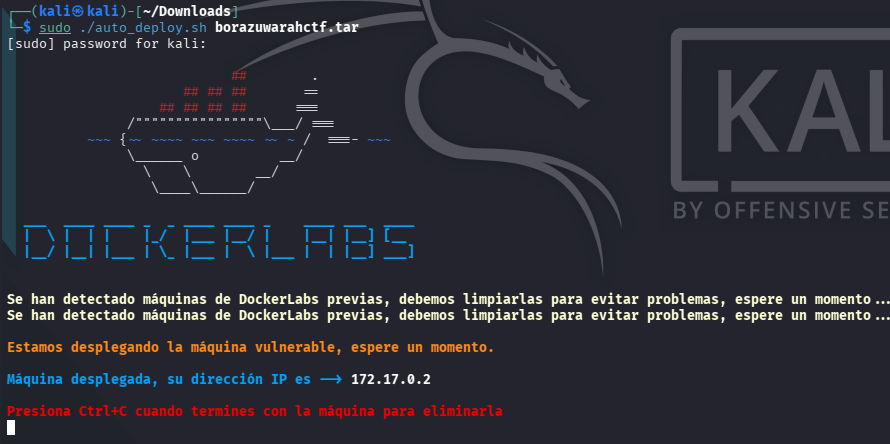

# DockerLabs: BorazuwarahCTF - Writeups (Muy Fácil)

¡Máquina vulnerada con exito, en la cual realice reconocimiento de puertos y servicios, ademas de una tecnica de investigación de metadatos




## Resumen de la Auditoría

## Objetivo:

Enumeración de rutas en web, y hacking de protocolos de red, principalmente SSH y FTP

---


## Inicio

### Descripción de la VM - Obsession


Laboratorio para practicar estaganografía y fuerza bruta contra protocolos de red


### Creador:

- Borazuwarah

---


## 📚 Comenzando

* Descargar la VM de DockerLabs - Hedgehog
* Descomprimir la VM desde la terminal de Kali

```
unzip borazuwarahctf.zip
```


* Archivo descomprimido

```
auto_deploy.sh
```

* Pasar a Super_Usuario

```
sudo su
```

* Correr la VM

```
sudo ./auto_deploy.sh borazuwarahctf.tar
```



<br></br>


## 1. Revisión de Conexión por paquetes ICMP


Existe conexión exitosa

<br></br>


## 2. Reconocimiento de Puertos y Servicios


Puerto:

```
Puerto 22: Servicio SSH

Puerto 80: Servidor Web HTTP
```

<br></br>


## 3. Enumeración Web


Al ingresar en el navegador con **http://172.17.0.2** encuentro una pagina web simple, solo una imagen

<br></br>


### Inspección con Exiftool 


Se aprecia un nombre de usuario pero no la contraseña

Además, en la pagina web no existe panel web evidente.

<br></br>


## 4. Explotación usando Hydra


Se obtiene el usuario el cual concuerda con el obtenido usando **exiftool**, además que aparece la contraseña

<br></br>


## 5. Intentando Conexión por SSH


Al utilizar la contraseña obtenida anteriormente, ya es posible entrar

<br></br>


## 6. Escalada Root


Indica una linea **(ALL) NO PASSWD: /bin/bash**.

Significa que el usuario puede invocar una shell root directamente


<br></br>


## 7. Convertirse en usuario Admin


Listo, de esta forma ya comprometi la VM


