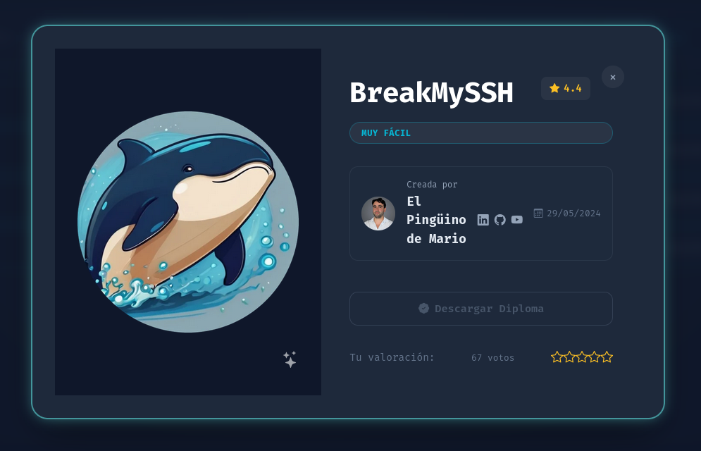
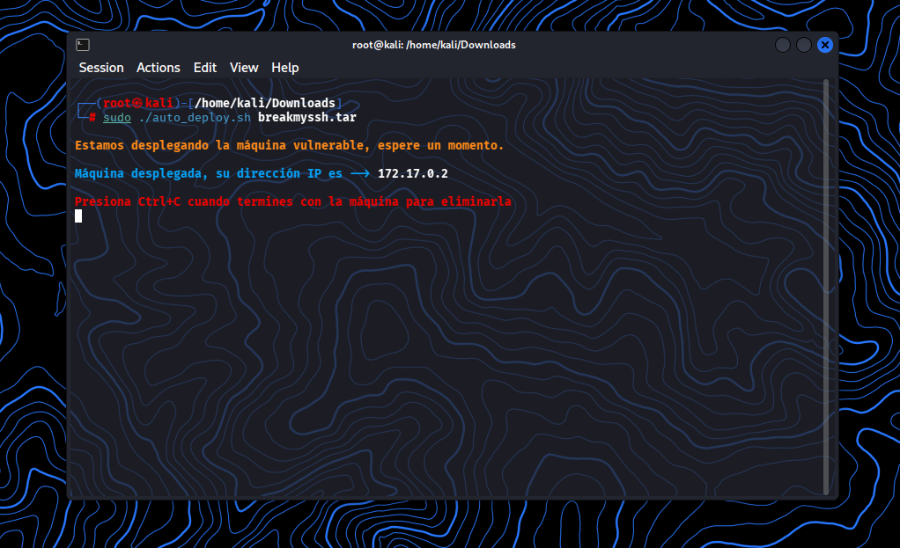
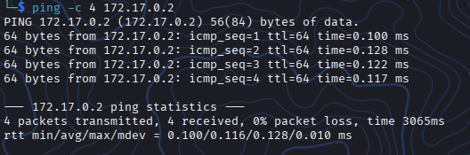
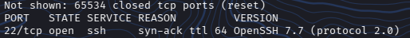
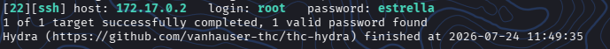
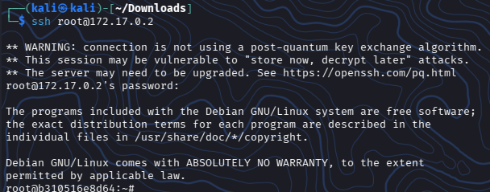
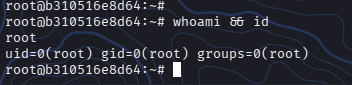

# DockerLabs: BreakMySSH - Writeup (Muy Fácil)


¡Maquina comprometida con exito y con una elevacion de privillegios a `root`!

Este repo contiene una documentación detallada del proceso de auditoria y explotacion de la VM local *BreakMySSH* de la plataforma de **DockerLabs**



## 🗺️ Resumen de la Auditoría

## Objetivo: 
Identificar servicios vulnerables, loggrar acceso y escalar privilegios al usuario administrador `root`.

## Vectores Utilizados:
- Reconocimiento
- Enumeración
- Explotación
- Conexión

---

## Inicio

### Descripción de la VM - BreakMySSH


Laboratorio para practicar ataques de fuuerza bruta con **Hydra** contra el servicio **SSH**


### Creador:

- El Pinguino de Mario

---


## 📚 Paso 00: Comenzando

* Descargar la VM de DockerLabs - BreakMySSH
* Descomprimir la VM desde la terminal de Kali

```
unzip breakmyssh.zip
```


* Archivo descomprimido

```
auto_deploy.sh
```

* Pasar a Super_Usuario

```
sudo su
```

* Correr la VM

```
sudo ./auto_deploy.sh breakmyssh.tar
```



<br></br>


## 🔎 Paso 01: Reconocimiento y Enumeración

### Reconocimiento

Como regla de oro procedemos a verificar que exista una conectividad entre la VM del atacante y el sistema target mediante el envio de paquetes ICMP

Con este comando verificamos que el host se encuentra activo y es accesible

```
ping -c 4 172.17.0.2
```


### Resultado




Podemos observar que el sistema target responde correctamente a las solicitudes ICMP enviadas

Con esto podemos confirmar que el host se encuentra totalmente activo y disponible


<br></br>


### Enumeración

Ya pudimos validar que existe conexión con el host, ahora vaamos a pproceder a realizar un escaneo completo de puertos y servicios

Usaremos el siguiente comando el cual lo detallaré mas abajo, lo utilizaremos para descubrir todos los servicios abiertos en la direccion IP **172.17.0.2** de la forma mas rápida y silenciosa posible


### Escaneo de Puertos y Servicios

```
sudo nmap -p- -sCV --open -sS --min-rate 5000 -vvv -n -Pn 172.17.0.2
```


### Bueno, desglocemos el comando utilizado

```
* sudo: ejecuta Nmap con privilegios de administrador(root). Esto es obligatorio para poder realizar el tipo de escaneo -sS(SYN), ya que requiere crear paquetes de red personalizados a nivel socket.

* -p-: Le dice a Nmapp que escanee los 655,535 puertos TCP existentes.

* -sCV: Esta es una combinación de dos funciones críticas:

    * -sC: Activa los script de enumeración por defecto de Nmap. Osea que si encuentra un puerto abierto, ejecuta pruebas automáticas de seguridad básicas.

    * -sV: Realiza una detección de versiones, Sirve para interrogar al puerto que se encuentra abierto para averiguar el software exacto y su version.

* --open: Filtrará los resultados para poder mostrar unicamente los puertos abiertos. No muestra los que esten cerrados o filtrados, para tener un resultado mas claro.


* -sS: SYN Scan /Stealth: Envía un paquete SYN(petición de conexión) y espera uuna respuesta. Osea si el objetivo responde, Nmap sabe que el puerto esta abierto, pero no completa la conexión.

* --min-rate 5000: Este fuerza a Nmap enviar un mínimo de 5,000 paquetes por segundo. Esto realizará un escaneo de los 65,535 puuertos en entornos locales o contenedores Docker en el menor tiempo posible.

* -vvv: Activa el nivel maximmo de detalle en la terminal.

* -n: Desactiva la resolución DNS. Este le dice a Nmap que no intente buscarr el nombre de dominio de la IP.

* -Pn: Desactivará el descubrimiento de hosts mediante Ping. Le ordena a Nmap que asuma que la maquina esta encendida y activa.
```

### Resultado

Podemos evidenciar que el puerto que se encuentra abierto es el:



Al ser el unico expuesto, el vector de ataque se reduce estrictamente a la explotación de SSH


<br></br>

## 💥 Paso 02: Explotación

Al no existir vulnerabilidades de algun tipo de ejecución remota de comandos, habrá que pasar a un vector de ataque que consista en adivinar las credenciales mediante un diccionario de palabras clave (**wordlist**)


### Comando a utilizar:

```
hydra -l root -P /usr/share/wordlists/rockyou.txt ssh://172.17.0.2 -t 4 -V
```


### Vamos a desglozar el comando a utilizar:

* -l root: Define el usuario especifico que queremos atacar, lo cual en este caso en particular es root.

* -P /usr/share/wordlists/rockyou.txt: Con esto utilizamos el famoso **rockyou.txt** de Kali, la cual contiene grandes cantidades de contraseñas filtradas.

* ssh://172.17.0.2: Especificamos el prrotocolo (SSH) y la direccion IP del target.

* -t 4: Configuuramos 4 hilos de ejecución simultaneos.

* -V: Muestra cada intento de combinacion de usuario/contraseña en pantalla.


### Resultado:



Pudimos encontrar dichas credenciales:

* Usuario: `root`
* Contraseña: `estrella`


<br></br>

## 🔌 Paso 03: Conexión

Ahora que pudimos obtener las credenciales necesarias, podemos realizar un flujo de intrusión y post-explotación


### Conectemos al objetivo (Ganar la Shell)

Usaremos el cliente de SSH para entrar al contenedor con las credenciales obtenidas anteriormente

```
ssh root@172.17.0.2
```


### Resultado




Perfecto ya dentro podemos realizar lo siguiente, confirmar la identidad y los privilegios.

Usando el comando:

```
whoami && id
```


Esto nos indica que tenemos el rango mas alto en el sistema
