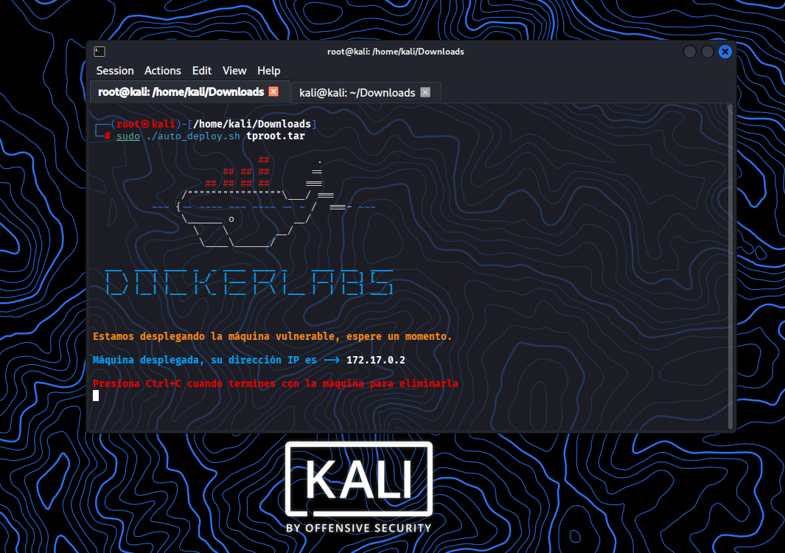
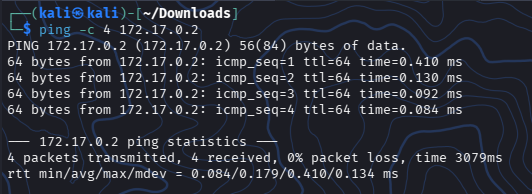
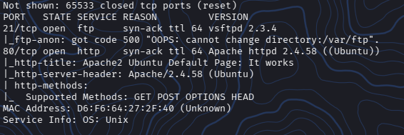
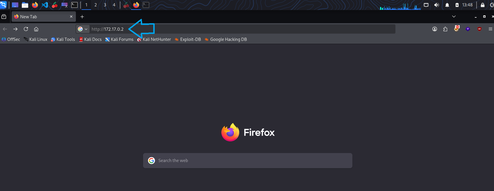
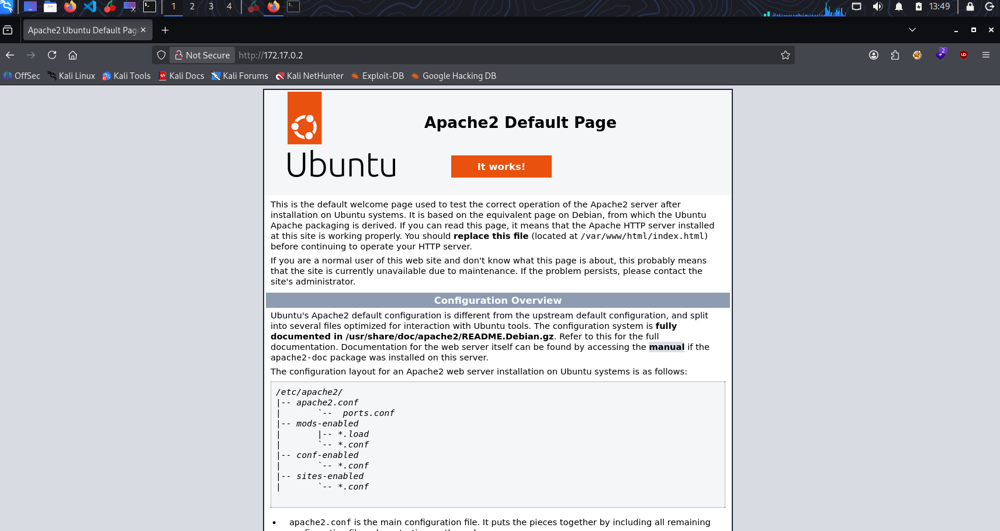
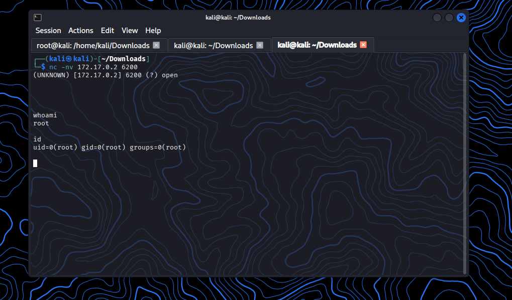

# DockerLabs: Tproot - Writeup (Muy Fácil)


¡Maquina comprometida con exito y elevacion de privilegios a `root`!

Este repo contiene la documentacion detallada del proceso de auditoria y explotacion de la VM local **Tproot** de la plataforma DockerLabs.


## 🗺️ Resumen de la Auditoría

### Objetivo: 
Identificar servicios vulnerables, obtener acceso y escalar privilegios al usuario administrador (`root`)

###  Vectores Utilizados:
- Reconocimiento
- Enumeracion
- Análisis
- Explotación

---


## Inicio:

### Descripción de la VM -Tproot


Laboratorio para practicar la explotación del backdoor de vsftpd 2.3.4 (CVE-2011-2523)
para obtener acceso root.

### Creador: 

- d1se0

---

<br></br>

## 📚 Paso 00: Comenzando

* Descargar la VM de DockerLabs - Tproot
* Descomprimir la VM desde la terminal de Kali

```
unzip tproot.zip
```

* Archivo descomprimido

```
auto_deploy.sh
```

* Pasar a Super_Usuario

```
sudo su
```

* Correr la VM

```
sudo ./auto_deploy.sh tproot.tar
```



<br></br>

## 🔎 Paso 01: Reconocimiento y Enumeración

### Reconocimiento

En una primera instancia, verificamos que exista una conectividad entre la VM atacante y el sistema target mediante el envio de paquetes ICMP:

Esto con el fin de confirmar que el host se encuentra activo y accesible

```
ping -c 4 172.17.0.2
```

### Resultado




Podemos observar que el sistema target responde correctamente las solicitudes ICMP enviadas.

Ademas, durante la prueba podemos observar un TTL=64, dicho valor es asociado a sistemas Linux.
Ya con esto podemos confirmar que el host se encuentra totalmente activo y disponible.


<br></br>


### Enumeración

Como hemos validado con exito la conexion con el host, podemos proceder a realizar un escaneo completo de puertos.

El objetivo acá es descubrir todos los servicios abiertos en la direccion IP **172.17.0.2** la cual pertenece a la VM target, esto debe hacerse de la forma mas rápida y silenciosa posible, además de que guardaremos el resultado en un archivo llamado: **escaneo_servicios**.

Es por lo anterior que procedemos a realizar un:

#### Escaneo de Puertos y Servicios

```
sudo nmap -p- -sCV --open -sS --min-rate 5000 -vvv -n -Pn -oN escaneo_servicios 172.17.0.2
```

### Resultado




Podemos identificar 2 puertos TCP abiertos en el sistema target.

- Servicio FTP expuesto en el puerto 21/tcp, ejecutando vsftpd 2.3.4
- Servicio HTTP expuesto en el puerto 80/tcp, ejecutando Apache 2.4.58(Ubuntu)


Esta vulnerabilidad de la version **vsftpd 2.3.4** con el puerto 21/tcp ya sabemos que es conocida comunmente por poseer un vector de ataque critico, ya que contiene un backdoor documentado que permite tener acceso de manera remota al sistema como root de una forma bastante directa.

<br></br>

## 📊 Paso 02: Análisis

Ya hemos logrado identificar dos servicios abiertos en el target.

Podemos comenzar con el puerto 80/tcp que pudimosidentificar durante el escaneo de puertos y servicios


Como este puerto es de un servicio HTTP podríamos intentar un ingreso directo a la direccion IP del sistema target de la siguiente manera:




Al cargar el enlace, se nos presenta una pagina por defecto de Apache2 Ubuntu, esto nos dice que el servidor funciona de forma correcta pero su pagina no cuenta con contenido especifico o personalizado, tal seria como una sección de autenticacion o alguna otra funcionalidad explotable.




### Resultado

Esta pagina que pudimos obtener no es considerada atacable


<br></br>

## 💥 Paso 03: Explotación

Volvamos a lo que encontramos en la etapa de Escaneo de Servicios.

Encontramos el servicio FTP que ejecutaba **vsftpd 2.3.4** en el puerto 21/tcp.
Con esta informacion podemos continuar.

En esta ocasión decidí utilizar la herramienta **Netcat** con campos de USER y PASS para no tener que ejecutar otro comando extra y realizar la tarea de manera mas sencilla.


### Resultado

Podemos observar en la imagen anterior que al dar enter al comando no genera ningun error.

Ahora podemos  abrir una nueva terminall para ejecutar el siguiente comando y poder generar una conexión al puerto 6200/tcp.

Utilizando la herramienta **Netcat** para poder activar el backdoor, solo basta con ejecutar el comando y ver el (open).




Ya dentro podemos ejecutar un **whoami** o un **id**, lo cual nos indica que tenemos acceso a la VM como root.
