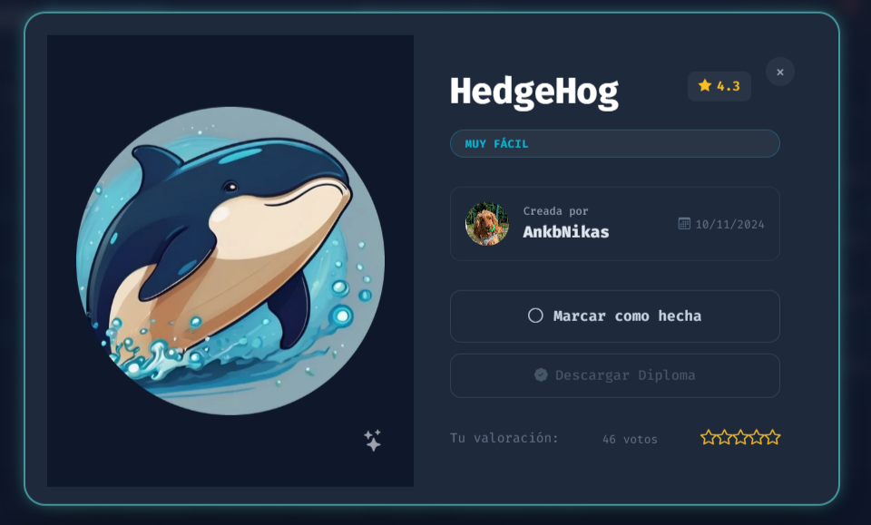
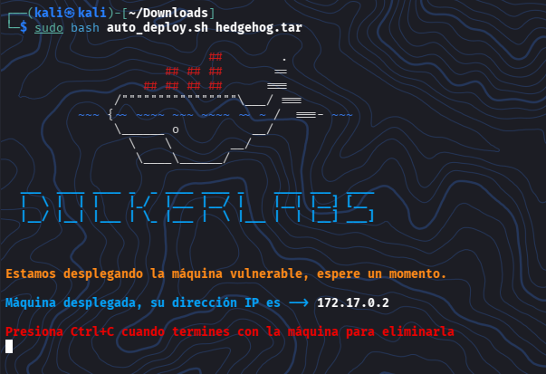

# DockerLabs: Hedgehog - Writeups (Muy Fácil)

¡Máquina comprometida con exito donde se realizo la práctica de fuerza bruta SSH y escalada de privilegios mediante movimiento de usuarios





## Resumen de la Auditoría

## Objetivo:

Prácticar fuerza bruta SSH y escalada de privilegios mediante movimiento entre usuarios


<br></br>
## Inicio

### Descripcion de la VM - Hedgehog


Laboratorio para practicar fuerza bruta **SSH** y escalada de privilegios mediante movimiento entre usuarios


### Creador:

- AnkbNikas


<br></br>
## 📚 Comenzando

* Descargar la VM de DockerLabs - Hedgehog
* Descomprimir la VM desde la terminal de Kali

```
unzip hedgehog.zip
```


* Archivo descomprimido

```
auto_deploy.sh
```

* Pasar a Super_Usuario

```
sudo su
```

* Correr la VM

```
sudo ./auto_deploy.sh hedgehog.tar
```



<br></br>


## 1. Verificamos Conectividad (Ping)

Comprobaremos que el contenedor está encendido y responde en la red interna de Docker:


La respuesta con el TTL de 64, nos confirma que es un sistema Linux y esta activo


<br></br>


## 2. Escaneo de Puertos con Nmap

Identificamos qué servicios están corriendo en la máquina de forma rápida y silenciosa


Podemos ver los puertos 22/tcp SSH y 80/tcp HTTP abiertos


<br></br>


## 3. Enumeración Web (Descubrimiento del usuario)

Inspeccionamos el contenido del puerto 80 usando **curl** para ver el texto plano que esconde el servidor **Apache**


Bueno, el comando nos devolvió unicamente la palabra **tails**, la cual utilizaremos como nombre de usuario


<br></br>


## 4. Preparación del Diccionario Invertido

Para poder optimizar el ataque de fuerza bruta, invertimos el diccionario **rockyou.txt** original y este removerá espacios blancos residuales


<br></br>


## 5. Fuerza Bruta por SSH con Hydra

Lanzaremos el ataque contra el servicio SSH usando el usuario descubierto y el diccionario modificado.

El parámetro **-f** detendrá el proceso al encontrar lo que buscamos


**Hydra** procesó las líneas del final del archivo y nos devolverá la contraseña que necesitamos


<br></br>


## 6. Acceso Inicial por SSH

Establecemos una sesión remota interactiva en el contendor con las credenciales obtenidas


Ya introducida la contraseña podemos ver que ya pudimos ingresar con éxito


<br></br>


## 7. Escalada de Privilegios Lateral (tails -> sonic)

Revisaremos las directrices de **sudo** asignadas a la cuenta actual


Como podemops ver la regla **(sonic) NOPASSWD: ALL**, ejecutaremos una shell en nombre de dicho usuario


<br></br>


## 8. Escalada de Privilegios Vertical (sonic -> root)

Ahora que actuamos como el usuario **sonic** (quien pertenece al grupo privilegiado **sudo**), obtendremos el control total del contenedor


