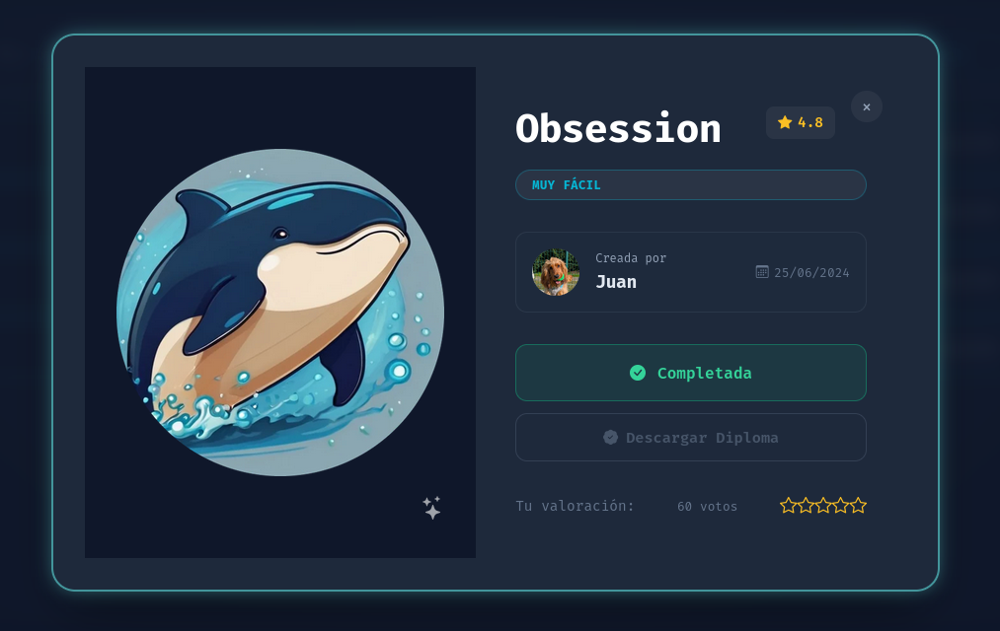
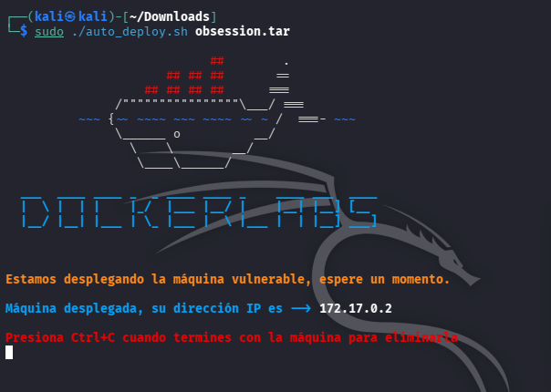

# DockerLabs: Obsession - Writeups (Muy Fácil)

¡Máquina vulnerada don exito, en la cual realice une enumeracion en web, hacking de protocolos, SSH y FTP





## Resumen de la Auditoría

## Objetivo:

Enumeración de rutas en web, y hacking de protocolos de red, principalmente SSH y FTP

---


## Inicio

### Descripción de la VM - Obsession


Enumeración de rutas web y hacking de protocolos de red, principalmente SSH y FTP


### Creador:

- Juan

---


## 📚 Comenzando

* Descargar la VM de DockerLabs - Hedgehog
* Descomprimir la VM desde la terminal de Kali

```
unzip hedgehog.zip
```


* Archivo descomprimido

```
auto_deploy.sh
```

* Pasar a Super_Usuario

```
sudo su
```

* Correr la VM

```
sudo ./auto_deploy.sh hedgehog.tar
```



<br></br>


## 1. Revisión de Conectividad por paquetes ICMP


<br></br>


## 2. Reconocimiento de Puertos y Servicios


<br></br>


## 3. Intento Conexión Mediante Login Anónimo

Claramente existe el puerto 21/tcp FTP por el cual podemos intentar un acceso sin credenciales


<br></br>


## 4. Enumeración de Archivos dentro de FTP


<br></br>


## 5. Descargo los Archivos


<br></br>


## 6. Leer el Contenido


Nombres dde usuarios potenciales


<br></br>


## 7. Ataque de Fuerza Bruta con Hydra al Puerto SSH


<br></br>


## 8. Intento de Conexión por SSH


<br></br>


## 9. Reconocimiento Inicial de Sistema


<br></br>


## 10. Veamos que privilegios de admin tiene


<br></br>


## 11. Esccalando privilegios de Usarios


<br></br>


## 12. Dentro del Editor VM escribir


<br></br>


## 13. Verificar el Nuevo Estatus


