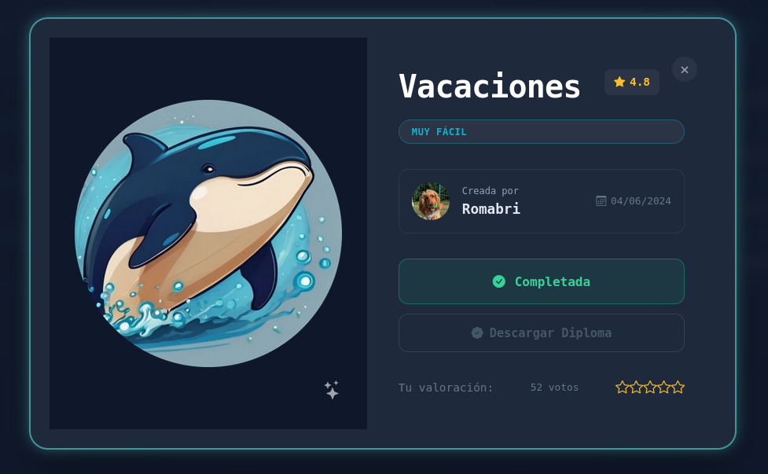
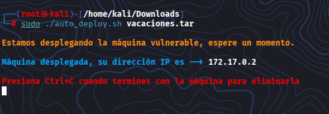
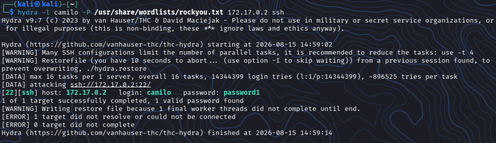

# DockerLabs: Vacaciones - Writeups (Muy Fácil)

¡Máquina vulnerada con exito, en la cual realice práctica de fuerza bruta contra SSH y escalada de privilegios





## Resumen de la Auditoría

## Objetivo:

Laboratorio para practicar fuerza bruta contra SSH y escalada de privilegios en Linux

---


## Inicio

### Descripción de la VM - Vacaciones


Laboratorio para practicar fuerza bruta contra SSH y escalada de privilegios en Linux


### Creador:

- Romabri

---


## 📚 Comenzando

* Descargar la VM de DockerLabs - Hedgehog
* Descomprimir la VM desde la terminal de Kali

```
unzip hedgehog.zip
```


* Archivo descomprimido

```
auto_deploy.sh
```

* Pasar a Super_Usuario

```
sudo su
```

* Correr la VM

```
sudo ./auto_deploy.sh hedgehog.tar
```



<br></br>


## 1. Verificar Conectividad (Ping)


Conexión funcionando correctamente


<br></br>


## 2. Reconocimiento de Puertos y Servicios Abiertos


Puertos abiertos

- 22/tcp open SSH 

- 80/tcp open HTTP


## 3. Enummeración Web

Tomando en cuenta que tengo el puerto 80/tcp abierto, intento ver en texto plano que encuentro


### Revisión de Estructura de Directorios


```
index.html -> al intentar ingresar con el link no hay nada que explotar 

javascript -> http://172.17.0.2/javascript/

Tampoco hay mucho en dicho link
```


## 4. Fase Intrusión - Acceso inicial 

En el paso de enumeración, tuve un resultado de 2 nombres, los cuales usare para esta fase de intrusión


¡No da ingreso! ... Pero

Como dice el texto plano...
De Juan para "Camilo"

## 5. Explotación

Entonces procedo a realizar lla explotación utilizando **Hydra**




```
Login: camilo

Password: password1
```

Ya teniendo las credenciales ingresare por SSH


¡Perfecto!


## 6. Obtener Acceso


Pude ingresar


## 7. Realizando Pivote

Podria leer el correo del que hablaba el texto anterior, dentro de la maquina para asi poder escalar al usuario **Juan**


Ejecuto como camilo

```
cd /var/mail/camilo
```


Me dice que es un directorio...


## 8. Listar los Ficheros que estan dentro

```
ls -la
```


Encontre un archivo .txt, a leerlo...


### Leyendo el contenido

```
cat correo.txt
```


Me entrego un mensaje y una contraseña que utilizare ahora...


## 9. Pasos Finales

Ahora ya debo realizar la elevacion de privilegios a **root**

All hacer un cambio de usuario a **Juan** y utilizando la contraseña encontrada en el archivo correo.txt, realizo un cambio de usuario y poara verificarlo se escribe un **whoami**


### Verificar Permisos de SuperUsuario de Juan

```
sudo -l
```


Esto me dice que el usuario **Juan** puede ejecutar binario como root sin necesidad de contraseña


### Paso Final

Pasar a **root** ejecutare el payload de Ruby listado en **GTFOBins**

```
sudo ruby -e 'exec "/bin/sh"'
```


Y ya ejecutando **whoami** nos da como resultado **root**


